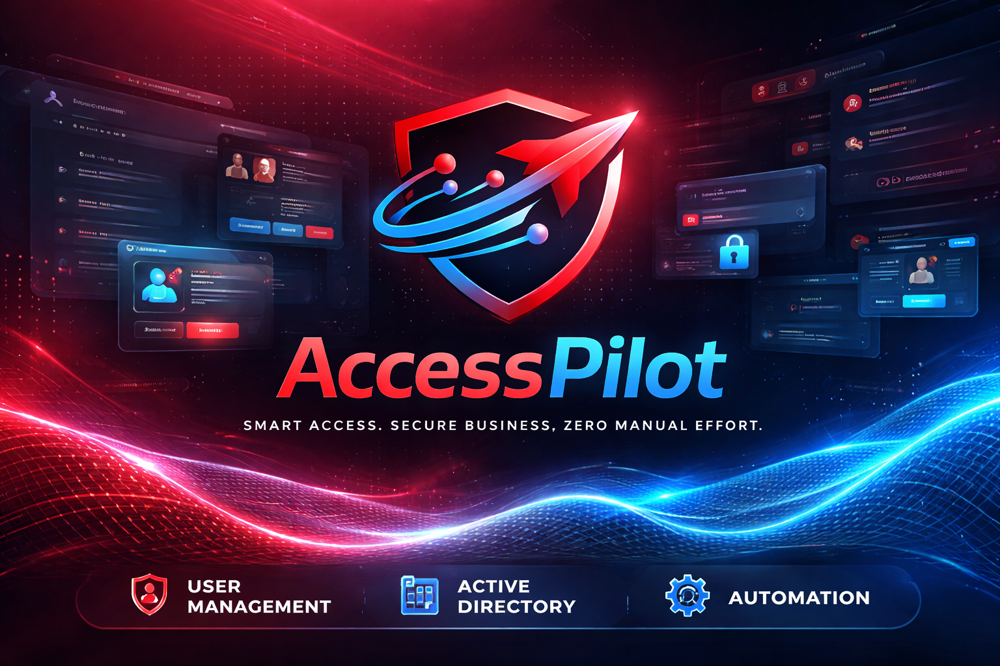
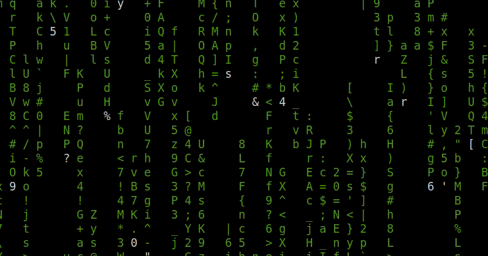

<div align="center">



# AccessPilot

### *One portal. Every identity. Zero friction.*

**Enterprise Identity · Active Directory · Exchange Administration Platform**

*a **Trendpilot** product*


-8892BF?logo=php&logoColor=white)


[Website](https://engr-rakib.github.io/web/) · [LinkedIn](https://www.linkedin.com/in/rkbzix/) · [Email Support](mailto:rakibcse47@gmail.com)

</div>

---

AccessPilot replaces day-to-day helpdesk toil with a fast, secure, intelligence-driven console for IT operations teams managing hundreds to tens of thousands of directory objects. Every routine identity, mailbox and infrastructure task — done in **seconds**, not ticket queues.

> 💡 **Free trial included** — install and run in **read-only evaluation mode**, no license needed. See [Installation](#-installation) to start, then [Trial & Subscription](#-trial--subscription) when you're ready.

---

## 📖 Table of Contents

- [Why AccessPilot](#-why-accesspilot)
- [How It Works](#-how-it-works)
- [Request Lifecycle](#-request-lifecycle)
- [Feature Highlights](#-feature-highlights)
- [Feature Deep Dive](#-feature-deep-dive)
- [Feature Pages — Page by Page](#-feature-pages--page-by-page)
- [Platform & Deployment Models](#️-platform--deployment-models)
- [Requirements & Installation Layout](#-requirements--installation-layout)
- [Installation](#-installation)
- [Trial & Subscription](#-trial--subscription)
- [Security & Compliance](#-security--compliance)
- [Documentation](#-documentation)
- [About Trendpilot](#-about-trendpilot)

---

## 💰 Why AccessPilot

Every approved identity request is a **person-minute drained from your team**. A single admin creates, disables, resets and unblocks accounts dozens of times a day. AccessPilot converts those repetitive, ticket-bound tasks into **seconds**, and makes identity management a **security control** — not a backlog.

| ❌ Without AccessPilot | ✅ With AccessPilot |
|------------------------|---------------------|
| 15–20 min to create one AD user by hand | **Seconds** — type an employee ID, click **New User** |
| Unlock/reset tickets queue for hours | One-click quick actions with instant feedback |
| Mailbox admin needs PowerShell expertise on-call | Anyone with permission operates mailboxes visually |
| No AD/Exchange health visibility until something breaks | Proactive monitoring + health checks + diagnostics |
| Auditing bolted on later, incomplete | Every operation logged & attributable by default |

**What it removes from your budget:**

- ⏱️ **Helpdesk hours** — routine tasks end in clicks, not L1/L2 tickets
- 🔁 **Human error & rework** — HRMS-driven provisioning gets OU, groups and attributes right the first time
- 🛡️ **Security exposure** — full audit + instant disable/reduce insider-threat and compliance cost
- 🧰 **Tool sprawl** — one portal replaces ad-hoc scripts, monitoring tools and viewers

> **You buy AccessPilot to buy back your team's time and make identity a security asset — not a ticket queue.**

---

## ⚙️ How It Works

AccessPilot is one secure console in front of everything your team touches every day.

```
  Operator / Helpdesk — browser, HTTPS
             │
             ▼
 ┌──────────────────── AccessPilot Portal ────────────────────┐
 │  Identity Lifecycle · People Insights · Exchange Studio    │
 │  Observability · Access & Governance · Automation & Reports│
 └───────────┬──────────────────────────────┬─────────────────┘
             ▼                              ▼
      Your Active Directory            Your Mail & Servers
   (users, groups, OUs, HRMS)     (Exchange, hosts, network)
```

**A typical workday in seconds:**

1. **Find** — instant lookup; one view merges AD identity + HRMS + security events + workstations.
2. **Act** — enable, disable, unlock, reset, group change, mailbox edit — single or **bulk** IDs.
3. **Automate** — type an employee ID → correct OU, groups and attributes applied automatically.
4. **Protect** — every operation permission-checked (270+ keys) and logged with actor, target, result.
5. **Observe** — live telemetry, health checks and diagnostics before users complain.

---

## 🔄 Request Lifecycle

Every identity operation follows a complete, auditable journey:

```
 REQUEST → AUTHORIZE → EXECUTE → VERIFY → AUDIT
    │          │          │        │         │
  Employee   RBAC       Backend    Result    Full trail
  Search   permission  (LDAP /    shown in  (who, what,
           check       PowerShell) feedback  when, result)
```

| Stage | What happens |
|-------|--------------|
| **Request** | Operator enters an employee ID — single or multiple IDs; ambiguous matches auto-suggested. |
| **Authorize** | Granular RBAC decides per action — no key, no execution. |
| **Execute** | LDAP native channel (primary) or PowerShell fallback for complex operations. |
| **Verify** | Per-user result cards show success / skipped / failed inline — bulk reports each ID. |
| **Audit** | Every page view and operation appended to the audit log. |

Full operator lifecycle → **[LIFECYCLE.md](docs/LIFECYCLE.md)**

---

## ⭐ Feature Highlights

### 🥇 Top Features

| | Feature | Value |
|--|---------|-------|
| ⚡ | **Intelligent user creation** | Employee ID in → correct OU, groups, attributes out (HRMS-driven) |
| 🔑 | **Quick AD actions** | Enable / disable / unlock / password reset — single or bulk, seconds |
| 📧 | **Exchange management** | Mailboxes, shared/room/equipment, groups, quotas, permissions, archives |
| 🖥️ | **Infrastructure monitoring** | vCenter-style live telemetry for hosts & containers |
| 🗂️ | **Reports & reconciliation** | HRMS↔AD status, user/OU/group reports, CSV exports |
| 🔎 | **Full audit trail** | Every page view and operation logged |

### 🏆 Advanced Features

| | Feature | Value |
|--|---------|-------|
| 🧭 | **Network & email diagnostics** | DNS, SPF/DKIM/DMARC, headers, blacklists, ping/traceroute/MTR/WHOIS, SMTP, BIMI, MTA-STS |
| 🛡️ | **Defense in depth** | CSRF, rate limiting, IP blocklisting, session hardening, forced termination |
| 🌐 | **Multi-domain AD** | Multiple forests from one portal; Exchange server auto-discovery |
| 🔐 | **Granular RBAC** | 270+ permission keys · 19 categories · 4 enforcement layers |
| 🐞 | **AD health check** | Deep domain-controller assessment with actionable report |
| 🏛️ | **Service account lifecycle** | Dedicated `svc_` flow — no interactive logon, strong password |

---

## 🔍 Feature Deep Dive

### 🔐 Password Manager — encrypted shared credentials

Team passwords never live in chat threads, spreadsheets or sticky notes again.

- **AES-encrypted at rest** — every credential is encrypted before it touches the database; plaintext never touches disk
- **Personal & shared vaults** — keep private credentials private, or toggle **sharing** so the right operators (permission-checked) can retrieve them
- **One-click copy** — copy-to-clipboard with automatic status-line stripping, so no metadata leaks into tickets
- **Full audit** — every view/copy/create/delete of a credential is logged with actor and timestamp
- **RBAC-scoped** — who can create, share or retrieve is controlled by the same 270+ key permission system

### 🗂️ OU & Groups Manager — full directory structure control

Build and reshape your Active Directory tree without ever opening ADUC.

- **Create / delete OUs** — organize your directory hierarchy in seconds
- **Create / delete groups** — security and distribution groups, full lifecycle
- **Membership management** — add or remove members from any group with fast pickers
- **Group & OU browsing** — searchable selectors wired into every workflow (user creation, modify, reports)
- **Safe deletes** — confirmation-guarded destructive operations, everything audited

### 🔄 HRMS ↔ AD Sync — one source of truth

Your HR system knows who should exist; AccessPilot makes the directory agree.

- **Intelligent provisioning** — type an employee ID → correct OU, groups, attributes, manager info pulled from HRMS automatically
- **Reconciliation report** — instantly spot divergences: users in AD but not in HRMS, HRMS entries missing an AD account, attribute mismatches
- **Employee Database** — full HRMS directory search and CRUD from inside the portal
- **AD↔HRMS status view** — per-user side-by-side comparison, always current
- **Offboarding safety** — disable + attribute-clear flows driven by HR truth, not memory

### 📊 Reports & Exports — audit-ready in one click

- **User reports** — full attribute dumps, filterable, exportable to CSV
- **OU & Group reports** — membership counts, nested structure, empty-group detection
- **HRMS↔AD reconciliation reports** — compliance evidence, exportable
- **Activity & audit exports** — who did what, when, filtered by operator/target/date

### 🩺 AD Health Check — know before it breaks

- **Deep domain-controller assessment** — replication, services, time sync, DNS, free disk, FSMO
- **Actionable report** — not just red/green: each finding ships with what it means and how to fix it
- **Scheduled or on-demand** — run from the portal any time; results stay in history for trend comparison

### ⚡ And the day-to-day savers

| | Feature | What it does |
|--|---------|--------------|
| ⚡ | **Bulk multi-ID operations** | Paste `emp01, emp02 emp03` — enable/disable/unlock/reset all at once, per-user results |
| 🏛️ | **Service account lifecycle** | Dedicated `svc_` flow: strong password enforced, no interactive logon, no admin groups |
| 🕵️ | **Security events & workstations** | Forensic per-user view: security events + every workstation they joined |
| 📮 | **Self-service request portal** | Users request AD/Exchange changes (15+15 types); admins approve/deny with tracking |
| 🔔 | **Notification center** | Bell, toasts, broadcasts, admin announcements, preferences |
| 🌍 | **Multi-domain AD** | Several forests, one portal — each domain with its own settings & Exchange auto-discovery |
| 🚫 | **IP blocking** | Blocklist/allowlist with CIDR at the web edge — attackers get silence, your team stays safe |
| 🎨 | **7 themes** | Corporate Blue → Matte Black; app-like navigation, zero page reloads |

> 📚 **Full catalog** — all 39 features with entry points and value mapping: [FEATURES.md](docs/FEATURES.md) · page-by-page guide: [APPLICATION_BOOK.md](APPLICATION_BOOK.md)

---

## 📸 Preview

<div align="center">

**A look inside the portal** — real screens, real workflows.


<sub><b>Dashboard</b> — quick actions, live monitoring, activity & notifications at a glance</sub>

<br/><br/>


<sub><b>Password Manager</b> — encrypted shared credential vault with sharing toggles</sub>

<br/><br/>

<table>
<tr>
<td width="50%"><br/><sub><b>OU & Groups Manager</b></sub></td>
<td width="50%"><br/><sub><b>HRMS ↔ AD Sync</b> — reconciliation view</sub></td>
</tr>
<tr>
<td width="50%"><br/><sub><b>Infrastructure Monitor</b> — vCenter-style telemetry</sub></td>
<td width="50%"><br/><sub><b>Exchange</b> — mailboxes, groups, permissions</sub></td>
</tr>
</table>

<br/>


<sub><b>AD Health Check</b> — deep domain-controller assessment with actionable report</sub>

</div>

---

## 📄 Feature Pages — Page by Page

Full button-by-button detail in **[APPLICATION_BOOK.md](APPLICATION_BOOK.md)**.

| Page | What you can do | Tier | Guide |
|------|-----------------|------|-------|
| **Dashboard** | Command center: quick actions, telemetry, key metrics | 🥇 TOP | [Book](APPLICATION_BOOK.md) |
| **User Creation** | Automatic (HRMS-driven) or manual provisioning incl. `svc_` accounts | 🥇 TOP | [USER_CREATION.md](docs/client/features/USER_CREATION.md) |
| **Edit User** | Attributes, OU moves, UPN, display name, contacts | 🥇 TOP | [MODIFY_USER.md](docs/client/features/MODIFY_USER.md) |
| **Quick Actions** | Enable/disable/unlock/reset — single or bulk | 🥇 TOP | [QUICK_ACTIONS.md](docs/client/features/QUICK_ACTIONS.md) |
| **User Info** | One-view profile: AD + HRMS + security events + workstations | 🥇 TOP | [GET_USER_INFO.md](docs/client/features/GET_USER_INFO.md) |
| **Employee Database** | Full HRMS directory search/edit from the portal | 🥈 CORE | [GET_USER_INFO.md](docs/client/features/GET_USER_INFO.md) |
| **Exchange** | Mailboxes, resources, groups, quotas, archives, monitoring | 🥇 TOP | [EXCHANGE_MANAGEMENT.md](docs/client/features/EXCHANGE_MANAGEMENT.md) |
| **Monitoring** | Live host/container telemetry, uptime/downtime history | 🥇 TOP | [RESOURCE_MANAGEMENT.md](docs/client/features/RESOURCE_MANAGEMENT.md) |
| **Email Tools** | DNS, headers, blacklists, validation, SMTP, BIMI, MTA-STS | 🏆 ADVANCED | [EMAIL_ANALYSIS_TOOLS.md](docs/client/features/EMAIL_ANALYSIS_TOOLS.md) |
| **Access Control** | Roles, 270+ permissions, approvals, online users | 🏆 ADVANCED | [ROLES_AND_PERMISSIONS.md](docs/client/features/ROLES_AND_PERMISSIONS.md) |
| **Password Manager** | Encrypted shared credential store with sharing toggles | 🏆 ADVANCED | [SECURITY_HARDENING.md](docs/client/features/SECURITY_HARDENING.md) |
| **Request Portal** | Self-service AD & Exchange requests with approval flow | 🥈 CORE | [REQUEST_PORTAL.md](docs/client/features/REQUEST_PORTAL.md) |
| **System Configuration** | Platform, directory and Exchange settings | 🥈 CORE | [AD_CONFIGURATION_GUIDE.md](docs/client/guides/AD_CONFIGURATION_GUIDE.md) |
| **User Activity** | Application event log, audit trail | 🥈 CORE | [SECURITY_HARDENING.md](docs/client/features/SECURITY_HARDENING.md) |
| **Profile / About** | Operator settings · version info | 🥈 CORE | [Book](APPLICATION_BOOK.md) |

> 🥇 TOP — run the helpdesk on these · 🏆 ADVANCED — platform differentiators · 🥈 CORE — daily operations

---

## 🖥️ Platform & Deployment Models

AccessPilot runs on both major platforms from the **same codebase**. **Linux + Docker is the recommended production platform** — battle-tested in production with pure-LDAP directory access, containerized isolation and one-command operations.

| Aspect | ⭐ Linux (Docker) — recommended | Windows (IIS) |
|--------|--------------------------------|---------------|
| Runtime | Container stack (HTTP + HTTPS managed) | Native IIS site with certificate binding |
| PHP | 8.2 bundled in the container image | 8.5 shipped with the IIS package |
| HTTPS | Managed by the container stack (auto self-signed → bring your own cert) | IIS certificate binding |
| Secure area | Mounted outside the web root (`/data/secure`) | Protected directory outside the web root |
| Directory access | Native LDAP channel | Native LDAP channel |
| Updates | `git pull` / re-download release + `docker compose up -d --build` | Package reinstall |

---

## 📋 Requirements & Installation Layout

### Hardware requirements

| Resource | Minimum | Recommended |
|----------|---------|-------------|
| CPU | 2 vCPU | 4 vCPU |
| RAM | 2 GB | 4–8 GB |
| Disk | 20 GB | 50 GB+ SSD (logs & monitoring history grow) |
| Network | LAN reachability to your Domain Controller (LDAP 389/636) | Same + access to Exchange & HRMS API |
| Ports | `80` HTTP, `443` HTTPS | Overridable via `APP_PORT` / `APP_PORT_SSL` |

### Where AccessPilot lives (installation target)

**Linux / Docker** (installer default):

```
/opt/accesspilot/          ← application code (safe to replace on upgrade)
/data/secure/              ← 🔐 THE VAULT — keep on persistent storage
├── ldap/<domain>/         ←   AD domain connections & credentials
├── vendor_issued_licenses/←   license certificates
├── ssl/                   ←   HTTPS certificate
└── app_notifications/     ←   notification data
/data/logs/                ← application + nginx logs
```

**Windows / IIS** (installer default):

```
C:\inetpub\accesspilot\           ← application code
C:\inetpub\accesspilot\public\    ← IIS web root
C:\inetpub\Desk_secure_files\     ← 🔐 THE VAULT (protected directory, outside web serving)
C:\access_pilot_logs\             ← application logs
```

### Environment overrides (optional)

| Variable | Default (Linux · Windows) | Purpose |
|----------|---------------------------|---------|
| `APP_PORT` / `APP_PORT_SSL` | `80` / `443` | HTTP / HTTPS listen ports |
| `ACCESSPILOT_DEST` | `/opt/accesspilot` · `C:\inetpub\accesspilot` | Install target |
| `ACCESSPILOT_SECURE_BASE_PATH` | `/data/secure` · `C:\inetpub\Desk_secure_files` | Vault location |
| `ACCESSPILOT_LOG_BASE_PATH` | `/data/logs` · `C:\access_pilot_logs` | Log location |

> 💡 **First boot takes 5–10 minutes** on Linux/Docker: the PHP image is built with PowerShell Core + Kerberos (Exchange integration), network diagnostic tools and PHP extensions baked in. Nginx deliberately waits until the HTTPS certificate is generated, then serves. Subsequent boots are fast.

> ⚠️ **Mount point preference:** put `/data` (or the Windows vault folder) on **dedicated persistent storage — RAID-1 recommended**. The vault holds your AD credentials, license and settings: it must survive container teardown, reinstalls and upgrades. Back it up; everything else is replaceable from a release download.

---

## 🚀 Installation

AccessPilot is **not distributed as a download**. The installer runs on YOUR live server, fetches the product directly and removes the source — the code never exists as a copyable artifact.

### Linux / Docker ⭐ (recommended)

```bash
ACCESSPILOT_INSTALL_TOKEN=<your-token> bash <(curl -fsSL https://raw.githubusercontent.com/engr-rakib/accesspilot/main/install.sh)
```

### Windows / IIS (PowerShell)

```powershell
$env:ACCESSPILOT_INSTALL_TOKEN='<your-token>'; irm https://raw.githubusercontent.com/engr-rakib/accesspilot/main/install.ps1 | iex
```

> 🔑 **The install token is issued by Trendpilot** (the vendor) — see [Trial & Subscription](#-trial--subscription). It grants install rights only and can be revoked anytime.

### What the installer does

1. Verifies prerequisites (Docker, git, rsync)
2. Fetches the product onto **this machine only** (source clone is deleted after deploy)
3. Creates the vault (`/data/secure`) + logs (`/data/logs`) on persistent storage
4. Starts the portal — first boot builds the image (5–10 min), then serves HTTPS

Deep dive → **[DOCKER_DEPLOYMENT.md](docs/client/features/DOCKER_DEPLOYMENT.md)**

---

---

## 🎫 Trial & Subscription

AccessPilot is a licensed product by **Trendpilot**. The repository owner is the vendor.

### 🆓 Free Trial — start today

Ask the vendor for a **trial install token** — no payment, no commitment.

- Install on your own server and explore **all 20+ pages, every workflow** — nothing is hidden
- Runs in read-only evaluation mode until you apply a license
- Your trial token can be revoked anytime; your server, your data

👉 Email/call the vendor below and you'll get a token, usually within hours.

### 📞 Contact the Vendor (repository owner)

For trials beyond evaluation limits, subscription pricing, demos or questions — contact me directly:

<div align="center">

| | |
|-|-|
| 🏢 **Vendor** | **Trendpilot** (this repository's owner) |
| ✉️ **Email** | [rakibcse47@gmail.com](mailto:rakibcse47@gmail.com) |
| 📱 **Phone / WhatsApp** | [+880 1955-653548](https://wa.me/8801955653548) — tap to chat or call |
| 🔗 **LinkedIn** | [linkedin.com/in/rkbzix](https://www.linkedin.com/in/rkbzix/) |
| 🌐 **Web** | [engr-rakib.github.io/web](https://engr-rakib.github.io/web/) |

</div>

### 💳 How to subscribe

1. **Get a trial token** — contact the vendor, install, evaluate freely on your own server.
2. **Contact us** — email/call the vendor with your requirement (number of operators, sites).
3. **Get machine ID** — from the in-app **License Center**, copy your **machine ID + site ID**.
4. **Receive certificate** — you get an **RSA-2048 signed certificate bound to your deployment**, usually within one business day of payment confirmation.
5. **Activate** — **License Center → Apply Certificate** → full operational power.

### 🔒 What the license guarantees

- Each certificate is **bound to your deployment** (machine + site ID) — it cannot be copied to another server.
- Expired or missing license → portal switches to **restricted read-only mode**. Operations never silently run unlicensed.
- Renewals and status are managed inside the app's **License Center**.

---

## 🛡️ Security & Compliance

<div align="center">

</div>

- 🛡️ **Defense in depth** — CSRF protection, rate limiting, IP blocklisting, session hardening as defaults
- 🔐 **Multi-layer RBAC** — 4 enforcement layers keep every screen role-scoped
- 🔏 **Backend redaction** — secrets masked before they reach logs or UI
- 📋 **Full auditability** — every page view and operation attributable to an operator

Hardening details → **[SECURITY.md](docs/SECURITY.md)**

---

## 📚 Documentation

```
APPLICATION_BOOK.md      ← the full book: every page + button, requirements, tech, workflows
docs/
├── ARCHITECTURE.md      ← how the platform is built
├── LIFECYCLE.md         ← journey of a request, start to end
├── FEATURES.md          ← the entire feature catalog (39 features)
├── SECURITY.md          ← security posture and hardening
└── client/
    ├── features/        ← feature-by-feature client docs
    └── guides/          ← configuration & API guides
```

---

<div align="center">


## 🏢 About Trendpilot

<div align="center">

</div>

**Trendpilot** builds AccessPilot — identity, Active Directory and Exchange administration that takes seconds, not ticket queues.

[Website](https://engr-rakib.github.io/web/) · [LinkedIn](https://www.linkedin.com/in/rkbzix/) · [rakibcse47@gmail.com](mailto:rakibcse47@gmail.com) · [+880 1955-653548](https://wa.me/8801955653548)

</div>

---

© 2026 Trendpilot · All Rights Reserved.
*AccessPilot* name, logo and product identity are property of **Trendpilot**. Designed & developed by **RKBZIX**.
Licensed per deployment — unlicensed evaluation runs limited to read-only mode.